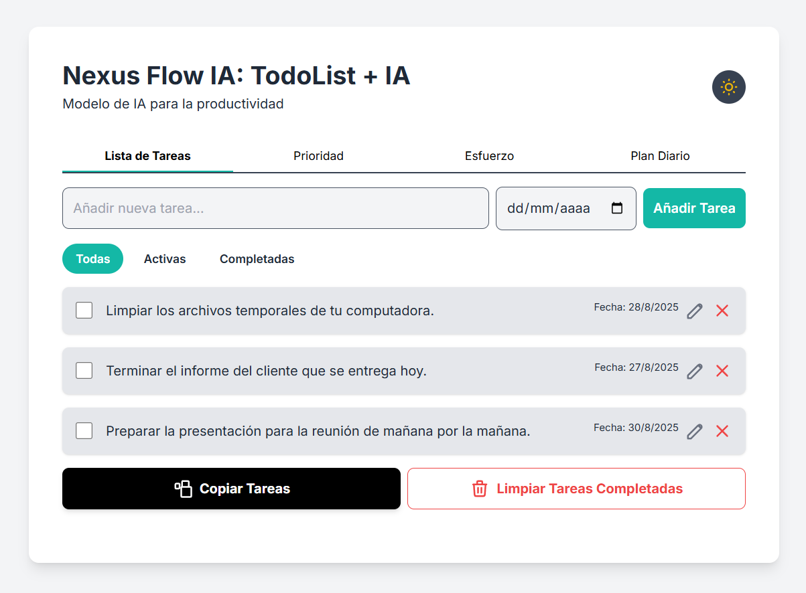
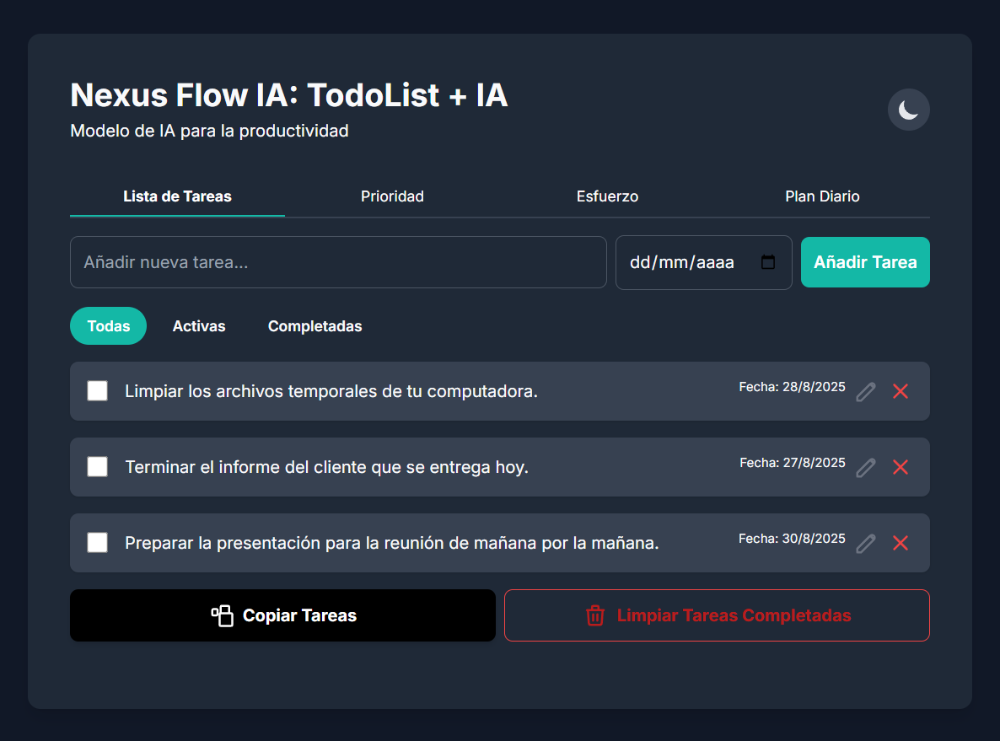
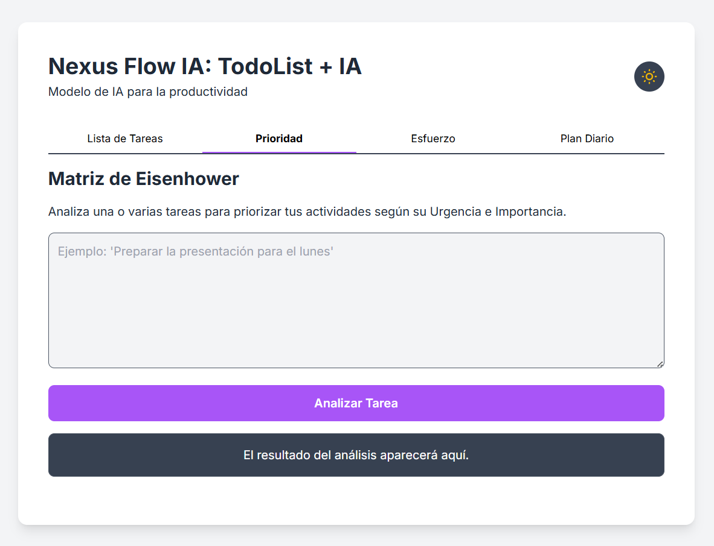
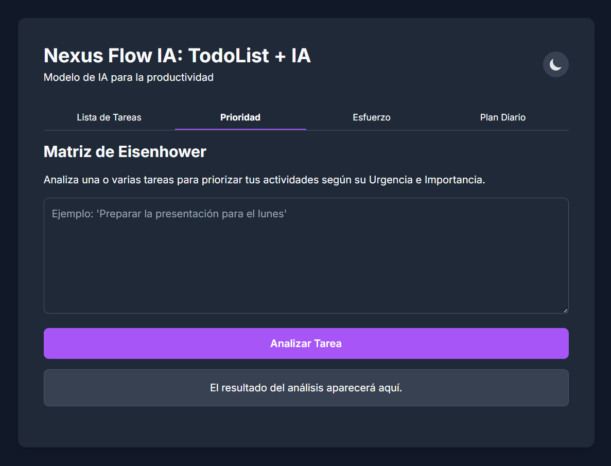
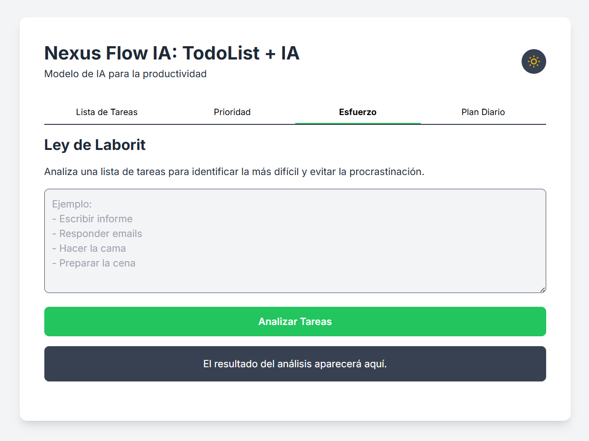
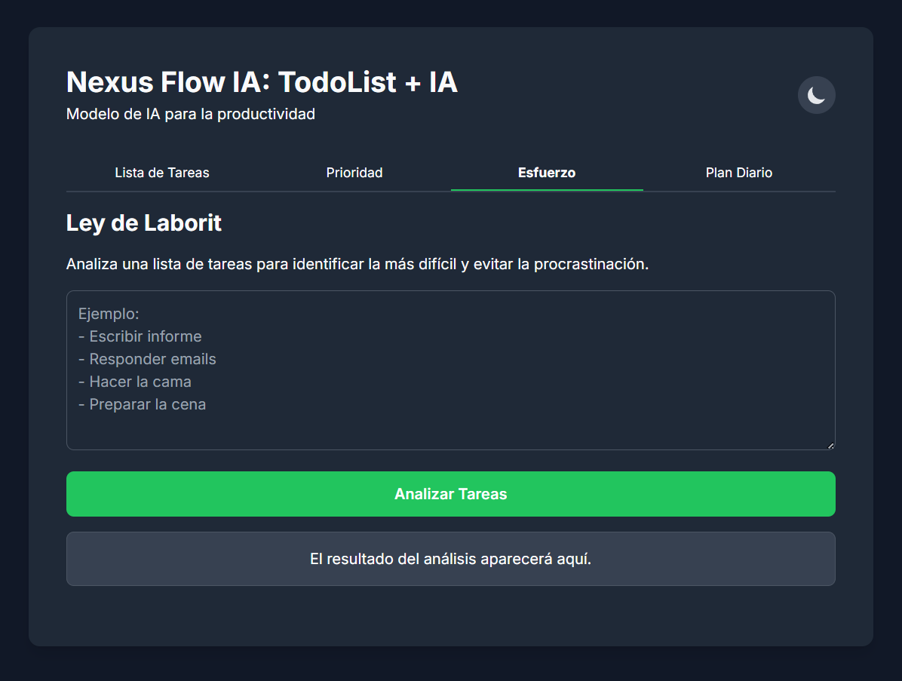
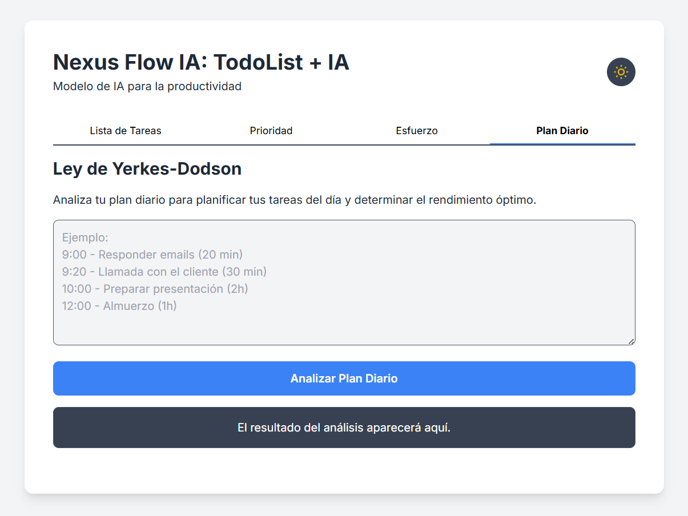
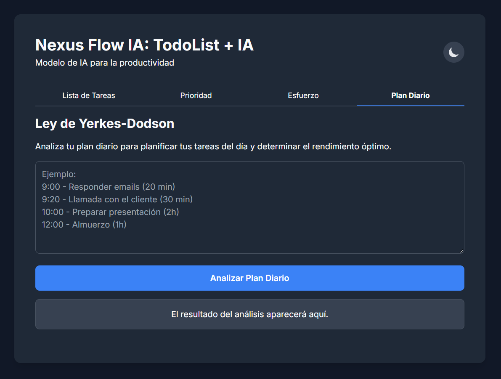

# Nexus Flow: Sistema de Gestión de Productividad Impulsado por IA

**Nexus Flow** es un proyecto de aplicación web para la productividad personal, diseñada para ayudarte a optimizar tu tiempo y energía. Su funcionalidad principal se basa en [Nexus GEM](https://github.com/ingwplanchez/nexus-gem), un prototipo de modelo de IA generativa integrado, que actúa como el "cerebro" inteligente de la plataforma.

Este sistema utiliza el poder de la inteligencia artificial para analizar tus tareas, planes diarios y hábitos de trabajo, ofreciéndote sugerencias estratégicas basadas en principios de productividad probados.

## Características Principales

**Nexus Flow** combina la funcionalidad de una lista de tareas con cuatro potentes herramientas de productividad. El corazón del proyecto es la inteligencia artificial de Google Gemini para procesar la lógica de negocio y las recomendaciones.

* **Lista de Tareas (TodoList):** Una interfaz limpia e intuitiva para añadir, marcar como completadas y gestionar tus tareas diarias.

* **Matriz de Eisenhower (Prioridad):** Analiza tus tareas para ayudarte a clasificarlas según su urgencia e importancia. Esta herramienta te guía para decidir qué hacer, qué planificar, qué delegar y qué eliminar.

* **Ley de Laborit (Esfuerzo):** Identifica la tarea más difícil o "menos apetecible" de tu lista. Al abordar esta tarea primero, la aplicación te ayuda a superar la inercia y evitar la procrastinación.

* **Ley Yerkes-Dodson (Plan Diario):** Analiza tu plan diario para ayudarte a optimizar el rendimiento. Sugiere cómo estructurar tu día para alcanzar un estado de "flujo" o rendimiento óptimo.

## Tecnologías Utilizadas

* **Backend:** **Python** con el framework **Django**.

* **Frontend:** **HTML5**, **CSS3**, **Tailwind CSS** y **JavaScript**.

* **APIs:** **Google Gemini API** (para la inteligencia artificial).

* **Otras librerías:** `django-cors-headers` (para seguridad y comunicación), `python-dotenv` (para la gestión de variables de entorno).

-----
## Capturas de Pantalla
Aquí puedes ver **Nexus Flow** en acción, mostrando sus diferentes vistas y el soporte para el modo claro y oscuro.

### Pestaña de Lista de Tareas (TodoList)



#### Modo Oscuro:


### Pestaña de Prioridad (Matriz de Eisenhower):



#### Modo Oscuro:


### Pestaña de Esfuerzo (Ley de Laborit):



#### Modo Oscuro:


### Pestaña de Plan Diario (Ley Yerkes-Dodson):



#### Modo Oscuro:


-----

## Cómo Iniciar el Proyecto

Sigue estos pasos para configurar y ejecutar Nexus Flow en tu entorno local.

1.  **Clona el repositorio:**
    ```
    git clone https://github.com/ingwplanchez/nexus-flow.git
    cd nexus-flow
    ```

2.  **Crea y activa un entorno virtual:**
    ```
    python -m venv venv
    source venv/bin/activate  # En Linux/macOS
    # o venv\Scripts\activate  # En Windows
    ```

3.  **Instala las dependencias necesarias:**
    ```
    pip install -r requirements.txt
    # O, si no tienes requirements.txt:
    # pip install Django Flask-Cors google-generativeai python-dotenv
    ```

4.  **Configura tu clave de API:**
    * Obtén tu clave de API de Gemini en [Google AI Studio](https://aistudio.google.com/app/apikey).
    * Crea un archivo llamado `.env` en el directorio raíz del proyecto y añade tu clave de la siguiente manera:
        ```
        GEMINI_API_KEY="TU_CLAVE_DE_API_AQUI"
        ```

5.  **Ejecuta las migraciones de la base de datos y el servidor:**
    ```
    python manage.py migrate
    python manage.py runserver
    ```

6.  **Accede a la aplicación:**
    Abre tu navegador web y navega a la siguiente URL:

    `http://127.0.0.1:8000`

